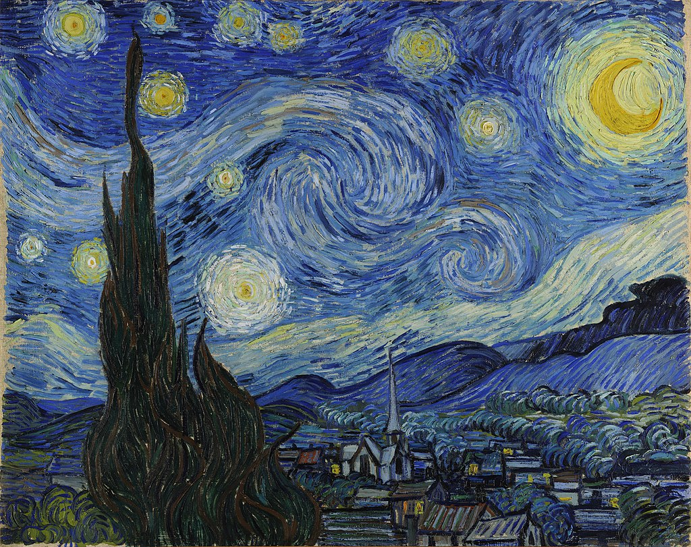
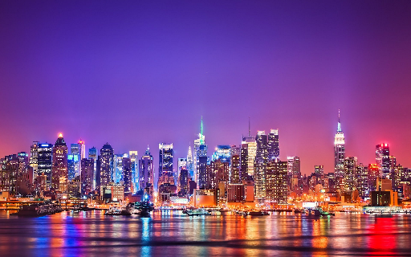

# Neural Style Transfer

This is an implementation of [neural style](http://arxiv.org/pdf/1508.06576v2.pdf) transfer in TensorFlow. 

This implementation includes a lot of small tweaks over the original paper like additional layers for calculating loss, non equal weights for each layer involved in calculating loss, additional feature such as maintaining original color in the stylized images.

# Examples

There are 2 sets of style layer weights available for different type of stylizing while one leads to more artistic results other leads to more content centric results

Input Images:

Output Images:

The left output was generated using weights that lead to more artistic results, the right one was generated using weights that lead to more content centric results

It is also possible to preserve the original colour of the content while transferring style

Input Images:

Output Images:

The left output is the original stylized image and the right one is stylized image with colours same as that of content image.
